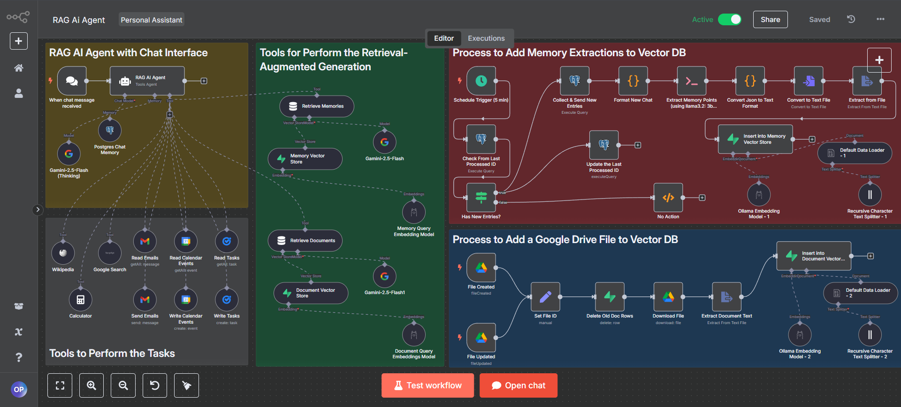

# RAG AI AGENT

## ✨ Key Features:
### 🧠 Memory System - The agent remembers our past conversations and builds context over time.
### 📚 Document Knowledge Base - Automatically processes files uploaded to Google Drive.
### 🔍 RAG Implementation - Uses vector databases to retrieve relevant context when answering questions.
### 🤖 Multi-Tool Integration including:
### 📧 Gmail for reading/sending emails
### 📅 Google Calendar for managing events
### ✓ Google Tasks for task management
### 🔢 Calculator for mathematical operations
### 🌐 Wikipedia and Google Search for information retrieval

## 💡 What I Love About This Build:
### 1.The clean architecture using n8n's visual workflow design.
### 2.Real-time document processing that keeps the knowledge base updated.
### 3.Memory extraction using Llama 3.2: 3b model to create persistent context.
### 4.Seamless integration with Supabase vector stores for efficient retrieval.
### 5.Uses LLMs running locally via Ollama for document processing and Google Gemini 2.5 Flash model for chat responses.

## 🔮 Future Improvements:
### 1. Adding Telegram integration for mobile access.
### 2. Implementing MCP (Model Context Protocol) which enables AI agents to access and interact with external tools, data sources, and applications, providing them with a consistent and standardized way to plug into the real world. Instead of needing custom integrations for each tool.
### 3.Adding speech-to-text and text-to-speech capabilities.
### 4. Supporting more document types and improving extraction quality.
